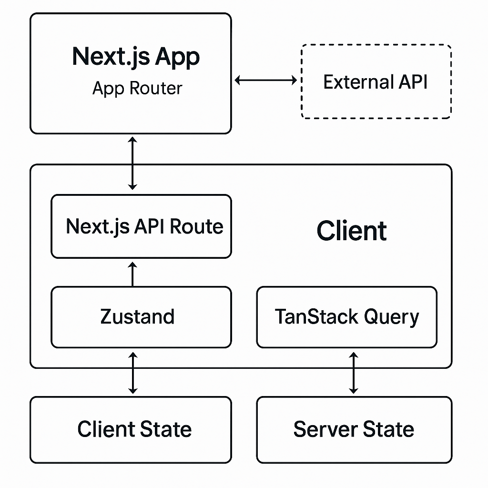

# BIGS 기술 과제 프로젝트

## 1. 프로젝트 개요

본 프로젝트는 BIGS 기업의 기술 과제 전형 통과를 목표로 제작된 Next.js 기반 웹 애플리케이션입니다.

제공된 [API 문서](https://documenter.getpostman.com/view/18478200/2sAY4vfh1u#intro)를 기반으로 사용자 인증, 게시글 CRUD(생성, 조회, 수정, 삭제) 등 핵심 기능을 구현하였으며, 실제 서비스 수준의 사용자 경험과 안정성을 제공하기 위해 모범적인 아키텍처 설계와 코드 품질 유지에 중점을 두었습니다.

## 2. 주요 기능 및 시연

### 🖥️ **반응형 디자인**

모바일, 태블릿, 데스크탑 등 모든 디바이스에서 최적의 사용자 경험을 제공하기 위해 반응형으로 디자인되었습니다.


### 👤 **사용자 인증**

- **회원가입**: 사용자는 아이디, 비밀번호, 이름, 프로필 이미지를 입력하여 회원가입을 할 수 있습니다.
- **로그인/로그아웃**: JWT 토큰 기반의 인증 시스템을 통해 안전하게 로그인 및 로그아웃 할 수 있습니다.


### 📝 **게시판 (CRUD)**

- **게시글 목록 조회**: 페이지네이션 기능이 포함된 게시글 목록을 조회할 수 있습니다.
- **게시글 상세 조회**: 특정 게시글의 상세 내용을 확인할 수 있습니다.
- **게시글 작성 및 수정**: 사용자는 새로운 게시글을 작성하고, 본인이 작성한 게시글을 수정할 수 있습니다.
- **게시글 삭제**: 본인이 작성한 게시글을 삭제할 수 있습니다.


## 3. 기술적 의사결정 및 아키텍처

면접 과정에서의 코드 리뷰를 염두에 두고, 아래와 같은 기술 스택과 설계 패턴을 도입하여 프로젝트의 확장성, 안정성, 유지보수성을 높였습니다.



### **Next.js App Router & BFF (Backend for Frontend)**

- **Next.js API Route**를 **BFF 패턴**으로 활용하여 외부 API 요청을 중계합니다.
- **장점**:
  1.  **보안 강화**: 클라이언트는 실제 API 엔드포인트와 API 키를 알 수 없으며, 서버 측에서 안전하게 토큰을 관리(**HttpOnly 쿠키**)하여 XSS 공격으로부터 토큰을 보호합니다.
  2.  **유연성**: 프론트엔드에 필요한 데이터만 가공하여 전달할 수 있습니다.
  3.  **CORS 정책 우회**: 서버 간 통신으로 브라우저의 CORS 정책을 우회할 수 있습니다.

### **TanStack Query (React Query) 기반 서버 상태 관리**

- **서버 상태 관리**를 위해 **TanStack Query**를 도입했습니다.
- **장점**:
  1.  **캐싱 및 데이터 동기화**: 서버 데이터를 자동으로 캐싱하고, `stale-while-revalidate` 전략을 통해 UI에 항상 최신 데이터를 보여줍니다.
  2.  **로딩 및 에러 상태 처리**: 데이터 fetching 시 발생하는 로딩, 성공, 에러 상태를 직관적으로 관리할 수 있습니다.
  3.  **코드 간소화**: `useEffect`와 `useState`를 조합하여 작성해야 했던 복잡한 비동기 로직을 선언적으로 관리할 수 있습니다.

### **Zustand 기반 클라이언트 상태 관리**

- **클라이언트 상태 관리**는 **Zustand**를 사용했습니다.
- **장점**:
  1.  **가벼움**: 별도의 보일러플레이트 없이 간결한 코드로 상태를 정의하고 사용할 수 있습니다.
  2.  **유연성**: React Context API와 달리 컴포넌트 트리 최상단에 Provider를 선언할 필요가 없습니다.

### **Component Driven Development (CDD)**

- UI를 독립적이고 재사용 가능한 컴포넌트 단위로 개발하는 **CDD 방법론**을 적용했습니다.
- `src/components` 디렉토리에 `ui`(원자), `feature`(기능), `layout`(레이아웃) 등으로 컴포넌트를 분류하여 코드의 재사용성과 유지보수성을 극대화했습니다.

## 4. 기술 스택

| 구분                 | 기술                                         |
| -------------------- | -------------------------------------------- |
| **Core**             | `Next.js` (v16), `React` (v19), `TypeScript` |
| **State Management** | `TanStack Query` (React Query), `Zustand`    |
| **Styling**          | `Tailwind CSS` (v4)                          |
| **HTTP Client**      | `Axios`                                      |
| **Code Quality**     | `ESLint`, `Prettier`, `Husky`, `lint-staged` |

## 5. 프로젝트 실행 방법

### **사전 요구사항**

- [Node.js](https://nodejs.org/ko) (v20.x 이상 권장)
- `npm`

### **설치 및 실행**

1.  **저장소 복제**

    ```bash
    git clone https://github.com/ryugi62/bigs-project.git
    cd bigs-project
    ```

2.  **의존성 설치**

    ```bash
    npm install
    ```

3.  **환경 변수 설정**
    - `.env.example` 파일을 복사하여 `.env.local` 파일을 생성합니다.
    - 과제 API 문서에 명시된 기본 URL을 입력합니다.

    ```bash
    cp .env.example .env.local
    ```

    ```.env.local
    # .env.local
    NEXT_PUBLIC_API_URL=https://assignment.bigs.co.kr
    ```

4.  **개발 서버 실행**

    ```bash
    npm run dev
    ```

5.  브라우저에서 [http://localhost:3000](http://localhost:3000)으로 접속합니다.

## 6. 폴더 구조

```
/src
├── app/              # Next.js App Router (페이지 및 API 라우트)
│   ├── (auth)/       # 인증 관련 페이지 그룹
│   ├── (main)/       # 메인 서비스 페이지 그룹
│   └── api/          # BFF 역할을 하는 API 라우트
├── components/       # 재사용 가능한 리액트 컴포넌트
│   ├── ui/           # 버튼, 인풋 등 원자 단위 컴포넌트
│   ├── auth/         # 인증 관련 기능 컴포넌트
│   └── boards/       # 게시판 관련 기능 컴포넌트
├── lib/              # API 클라이언트, 훅, 유틸리티 함수
│   ├── api/          # API 호출 관련 로직
│   ├── http/         # Axios 클라이언트 및 인터셉터 설정
│   └── query/        # TanStack Query 관련 설정 (키 팩토리 등)
├── store/            # Zustand 스토어
└── types/            # 공용 타입 정의
```
